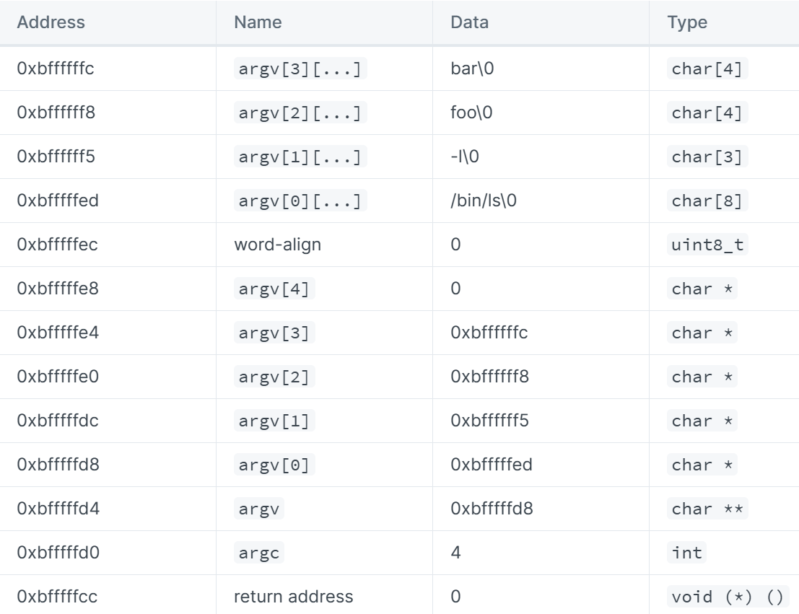
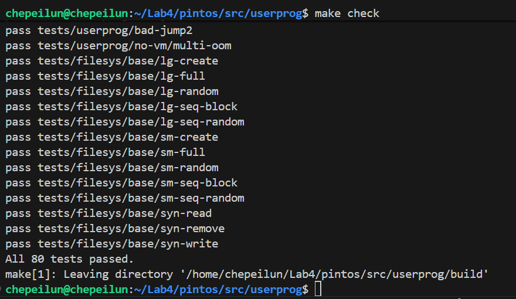

# Pintos Project 2: User Programs 实验报告


## 一、 实验目的与内容

### 实验目的
本实验旨在为 Pintos 操作系统内核增加对用户程序的完整支持。在实验开始前，Pintos 仅能运行单线程的内核代码。通过本实验，我们将实现：
1.  **参数传递 (Argument Passing)**：让用户程序能接收命令行参数。
2.  **系统调用 (System Calls)**：建立用户态与内核态的交互桥梁。
3.  **进程管理 (Process Management)**：实现进程的创建、执行、等待和终止。
4.  **文件系统接口 (File System Interface)**：提供安全的文件读写能力。

### 实验背景

- 根据Pintos官方文档所示，我们允许一次运行多个进程，但每个进程都只有一个线程（不支持多线程的进程）。用户程序是在他们拥有整个计算机的错觉下编写的。这意味着当您一次加载并运行多个进程时，必须正确管理内存、调度和其他状态以维持这种错觉。

- 在上一个项目中，我们将测试代码直接编译到内核中，因此我们必须用到内核中某些特定的功能接口。从现在开始，我们将通过运行用户程序来测试您的操作系统。这给您更大的自由。您必须确保用户程序界面符合此处描述的规范，但是在有此约束的情况下，您可以随意重组或重写内核代码。

### 实验相关程序
1. `userprog/process.c`, `userprog/process.h`：加载ELF二进制文件并启动进程。
2. `userprog/syscall.c`, `userprog/syscall.h`：定义系统调用接口。每当用户进程想要访问某些内核功能时，它就会调用系统调用。 这是一个系统调用处理程序的骨架。当前，它仅打印一条消息并终止用户进程。 在该项目的第2部分中，您将添加执行其他所有操作系统调用所需要的代码。
3. `userprog/paging.c`, `userprog/paging.h`：80x86硬件页表的简单管理器。尽管您可能不想为该项目修改此代码，但是您可能希望调用其某些功能。
4. `threads/thread.h`：线程数据结构。

### 实验内容
1. Pintos在实现时并没有考虑参数分离问题。而用户程序也会需要执行一些没有权限的操作，这时便需要系统调用，需要我们实现相应的功能。
2. 实现函数系统调用，通过系统调用测试集`create、 exec、 wait、 halt、 open、 close、 read、write、 tell` 等一系列测试：
    - `halt`()函数
    用于终止当前pintos系统的运行。

    - `exit()`函数
    用于退出当前用户程序，输出退出的状态，并将状态告知内核。

    - `exec()`函数
    用于执行给定文件名的程序。

    - `wait()`函数
    用于等待由pid指定的子进程的结束。

    - `create()`函数
    以给定的文件名和文件大小来创建文件，并把它添加到现有的文件系统当中。

    - `remove()`函数
    用于将文件从现有文件系统中删除。

    - `open()`函数
    传入文件名，打开相应文件。

    - `filesize()`函数
    用于返回文件大小（以字节为单位）。

    - `read()`函数
    用于将指定文件中的指定数量的字符读进buffer/文件中，返回成功读进的字符数。

    - `write()`函数
    用于将buffer中指定数量的字符写入buffer/文件中，返回成功写入字符数。

    - `seek()`函数
    用于指定下一个读写的字节的位置，下一次的读写操作都将从该位置开始。

    - `tell()`函数
    返回文件中下一个将要被读写的字节位置。

    - `close()`函数
    用于关闭文件。

---

## 二、实验环境配置

1. 在userprog下执行`make`命令生成build文件夹,切换到build文件夹下创建用户磁盘：<br>
`pintos-mkdisk filesys.dsk --filesys-size=2` <br>创建成功后可以看到生成了`filesys.dsk`磁盘。
2. 执行如下命令：
    ```
    pintos -f -q
    pintos -p ../../examples/echo.c -a echo -- -q
    pintos -q run 'echo x’
    ```
    可以看出pintos将echo x作为整体来执行了，而不是运行echo，并传递参数x，未实现参数分离。

---

## 三、实验过程与分析
### Part1 参数传递
参数传递的任务是重写process_execute()以及相关函数，使得传入的filename分割成文件名、参数，并压入栈中。

- 阅读文档中 Program Startup Details 了解如何把命令行参数压栈
- 阅读 `string.c`, `process.h` 了解函数功能.
  - `strtok_r`: 第一次调用时, s 是要分离参数的字符串, 之后调用时 `s` 位置必须为空。每次返回值是字符串的下一个参数指针, 如果没有下一个参数, 返回 `NULL`
- 阅读 `process.c`, `process.h` 了解函数功能
  - `process_execute()`创建进程, 创建进程中的唯一线程, 线程执行 `start_process` 函数 
  - `start_process` 设置中断, 调用 `load` 函数创建用户地址空间
  - `load` 函数执行完成之后, 调用 `setup_stack` 创建用户栈

首先在`threads/thread.h`中添加参数传递的成员变量，注释中有详细的讨论：
```cpp
struct thread {
  /* Owned by thread.c. */
  tid_t tid;                 /* Thread identifier. */
  enum thread_status status; /* Thread state. */
  char name[16];             /* Name (for debugging purposes). */
  uint8_t *stack;            /* Saved stack pointer. */
  int priority;              /* Priority. */
  struct list_elem allelem;  /* List element for all threads list. */

  /* Shared between thread.c and synch.c. */
  struct list_elem elem; /* List element. */

#ifdef USERPROG
  /* Owned by userprog/process.c. */
  uint32_t *pagedir; /* Page directory. */
#endif
  /* Project 2 新增：父子关系与同步、文件/FD 管理 */
  struct thread *parent;  // 父进程指针：用于创建/等待阶段的同步
  struct list child_list; // 子进程的 shadow 列表，父进程用来跟踪子状态

  struct thread_shadow *to;     // 指向自己的 shadow，用于向父进程报告退出码等
  struct semaphore sema_create; // 创建阶段同步：子完成加载后唤醒父
  struct semaphore sema_wait;   // 等待阶段同步：父在此等待子退出
  bool create_success;          // 子进程是否创建/加载成功
  int exit_code;                // 子进程的退出码（由系统调用/异常设置）

  struct file *exec_file;       // 当前正在执行的文件（运行期间 deny_write）
  struct list file_list;        // 打开文件的 FD 映射列表（file_shadow）
  int next_fd;                  // 文件描述符分配起点（0/1 为 stdin/stdout，故从 2 开始）

  /* Owned by thread.c. */
  unsigned magic; /* Detects stack overflow. */
};

struct lock filesys_lock;
/* 子进程影子（父进程持有）
 * 记录 tid、退出码与存活状态，配合 child_list 管理；当父进程等待时由子进程唤醒。 */
struct thread_shadow {
  tid_t tid;
  struct thread *from;            // 指向子进程本体（存活时有效）
  int exit_code;                  // 子进程结束时的退出码
  bool is_alive, is_being_waited; // 是否存活；是否已被父进程等待（一次性）

  struct list_elem child_elem; // 配合 child_list
};

/* 文件影子（线程持有）
 * 将递增的 FD 映射到底层 struct file*，便于在系统调用中检索。 */
struct file_shadow {
  int fd;
  struct file *f;
  struct list_elem elem;
};
```
#### 1.1 修改`process_execute()`函数，正确获取变量名
```cpp
tid_t process_execute(const char *file_name)
{
  /* 复制命令串两份：一份交给加载线程使用，另一份用于解析进程名。
   * 这样可以避免原始指针越界与竞态读取。 */
  char *fn_copy, *get_name;
  tid_t tid;

  // 把文件拷贝两次, 这样就不会访问到 原来 file_name 的内容从而越界
  fn_copy = palloc_get_page(0);
  get_name = palloc_get_page(0);
  if (fn_copy == NULL || get_name == NULL)
    return TID_ERROR;

  strlcpy(fn_copy, file_name, PGSIZE);
  strlcpy(get_name, file_name, PGSIZE);

  // 获取进程名字
  char *save_ptr;
  get_name = strtok_r(get_name, " ", &save_ptr);

  /* Create a new thread to executeute FILE_NAME. */
  tid = thread_create(get_name, PRI_DEFAULT, start_process, fn_copy);
  // 释放没用的 get_name 内存
  palloc_free_page(get_name);

  if (tid == TID_ERROR)
    palloc_free_page(fn_copy);

  struct thread *cur = thread_current();
  sema_down(&cur->sema_create);
  if (!cur->create_success)
    return -1;

  return tid;
}
```
- 首先创建`file_name`的两份拷贝，避免`caller`和`load`的冲突。之后利用`lib/string.c`中的`strtok_r()`函数将传进来的`file_name`以空格为界限，分割为线程名和参数，将该文件名存放到`fn_copy2`中，为参数传递做准备。
- 调用`thread_create()`，创建子线程，返回线程号。让子线程执行`start_process`函数。手动释放`fn_copy2`空间。

#### 1.2 修改 `start_process` 函数, 获取正确文件名, 分离参数并压栈
```cpp
static void
start_process (void *file_name_)
{
  char *file_name = file_name_;
  struct intr_frame if_;
  bool success;
  /* Initialize interrupt frame and load executeutable. */
  memset (&if_, 0, sizeof if_);
  if_.gs = if_.fs = if_.es = if_.ds = if_.ss = SEL_UDSEG;
  if_.cs = SEL_UCSEG;
  if_.eflags = FLAG_IF | FLAG_MBS;

  // new
  // 创建备份页面
  char *cmd = palloc_get_page(0);
  strlcpy(cmd, file_name_, PGSIZE);
  // 提取文件名
  char *save_ptr, *token;
  file_name = strtok_r(file_name, " ", &save_ptr);

  success = load (file_name, &if_.eip, &if_.esp);

  if (!success)
  {
    palloc_free_page(cmd);
    palloc_free_page(file_name);
    thread_exit ();
  }

  // 把参数信息放到栈中
  push_argument(&if_.esp, cmd);
  // hex_dump((uintptr_t)if_.esp, if_.esp, (PHYS_BASE) - if_.esp, true); 

  // 此时 cmd 已经解析完了, 之后不会再用到, 所以释放
  palloc_free_page(file_name);
  palloc_free_page(cmd);

  // end new

  asm volatile ("movl %0, %%esp; jmp intr_exit" : : "g" (&if_) : "memory");
  NOT_REACHED ();
}
```
- 拷贝`file_name`，初始化中断，分割`file_name`得到实际的线程名和参数。
- 若调用`load`，正确加载了可执行文件，分离参数，移动栈指针，将`argv`参数数组按`argc`的大小推入栈。
- 保存主线程状态为成功执行，提升其信号量。
#### 1.3 实现压栈的函数`push_argument()`, 根据官方文档一步一步设置栈。

```cpp
void push_argument(void **esp, char *cmd)
{
  // (*esp) 等价于 if_.esp
  // (*(int *)(*esp)) 表示栈中存的真实值

  // 参数数量和参数列表地址
  int argc = 0, argv[64];
  char *token, *save_ptr; 

  (*esp) = PHYS_BASE;

  for (token = strtok_r(cmd, " ", &save_ptr); token != NULL;
       token = strtok_r(NULL, " ", &save_ptr))
  {
    size_t len = strlen(token);
    (*esp) -= (len + 1);
    memcpy((*esp), token, len + 1);
    argv[argc++] = (*esp);
  }

  (*esp) = (int)(*esp) & 0xfffffffc;  // word_align
  (*esp) -= 4, (*(int *)(*esp)) = 0;  // argv[argc]

  for (int i = argc - 1; i >= 0; i--) // argv[i];
    (*esp) -= 4, (*(int *)(*esp)) = argv[i];

  (*esp) -= 4, (*(int*)(*esp)) = (*esp) + 4; // argv
  (*esp) -= 4, (*(int*)(*esp)) = argc;       // argc
  (*esp) -= 4, (*(int*)(*esp)) = 0;          // return address
}
```
#### 1.4 参数传递总结
`process_execute`创建线程，并分离参数，并把参数（含文件名）传递给`start_process`函数，让新线程执行`start_process`函数。`start_process`将参数继续传递给`load`函数，`load`函数为用户程序分配了地址空间，并继续将参数传递给`setup_stack`函数，`setup_stack`创建了用户栈并返回到`load`，`load`返回到`start_process`。接下来，在`start_process`中调用`push_argument`将用户程序所需的参数`argc`,`argv`及他们的地址入栈。这样就利用参数传递，完成了用户程序执行的准备过程。

---

### Part2 系统调用
这里将2、3、4的内容整合到一起讨论。
首先通过阅读 `syscall.c` 上方的 `<syscall-nr.h>` ，明确了我们需要实现的功能。
```
	SYS_HALT,                   /* Halt the operating system. */
    SYS_EXIT,                   /* Terminate this process. */
    SYS_EXEC,                   /* Start another process. */
    SYS_WAIT,                   /* Wait for a child process to die. */
    SYS_CREATE,                 /* Create a file. */
    SYS_REMOVE,                 /* Delete a file. */
    SYS_OPEN,                   /* Open a file. */
    SYS_FILESIZE,               /* Obtain a file's size. */
    SYS_READ,                   /* Read from a file. */
    SYS_WRITE,                  /* Write to a file. */
    SYS_SEEK,                   /* Change position in a file. */
    SYS_TELL,                   /* Report current position in a file. */
    SYS_CLOSE,                  /* Close a file. */
```
通过阅读文档可知, 系统调用的编号在栈顶 `esp` 位置。
通过 `pintos/src/lib/user/syscall.c` 的内容可知, 使用系统调用的方式是通过 `syscall` 的宏。
#### 2.1 实现 `syscall` 宏
```cpp
void syscall_halt(struct intr_frame *f)
{
}
void syscall_exit(struct intr_frame *f)
{
}
void syscall_exec(struct intr_frame *f)
{
}
void syscall_wait(struct intr_frame *f)
{
}
void syscall_create(struct intr_frame *f)
{
}
void syscall_remove(struct intr_frame *f)
{  
}
void syscall_open(struct intr_frame *f)
{
}
void syscall_filesize(struct intr_frame *f)
{
}
void syscall_read(struct intr_frame *f)
{
}
void syscall_write(struct intr_frame *f)
{
}
void syscall_seek(struct intr_frame * f)
{
}
void syscall_close(struct intr_frame *f)
{
}

int (*func[20])(struct intr_frame *);

void
syscall_init (void) 
{
  intr_register_int (0x30, 3, INTR_ON, syscall_handler, "syscall");

  func[SYS_HALT] = syscall_halt;
  func[SYS_EXIT] = syscall_exit;
  func[SYS_EXEC] = syscall_exec;
  func[SYS_WAIT] = syscall_wait;
  func[SYS_CREATE] = syscall_create;
  func[SYS_REMOVE] = syscall_remove;
  func[SYS_OPEN] = syscall_open;
  func[SYS_FILESIZE] = syscall_filesize;
  func[SYS_READ] = syscall_read;
  func[SYS_WRITE] = syscall_write;
  func[SYS_SEEK] = syscall_seek;
  func[SYS_TELL] = syscall_tell;
  func[SYS_CLOSE] = syscall_close;
}
```
系统调用部分的初始化。通过`syscall`数组来存储13个系统调用，在`syscall_handler`中决定调用哪一个。

#### 2.2 实现 `syscall_handler`
```cpp
/* 系统调用总入口
 * 步骤：先校验用户栈指针，再读出系统调用号并检查范围，最后分派到具体实现。
 * 异常：非法指针/编号将导致进程以 -1 退出。
 */
static void
syscall_handler(struct intr_frame *f UNUSED)
{
  check_ptr(f->esp, 4);
  int number = *(int *)(f->esp);
  if (number < 0 || number >= 20 || func[number] == NULL)
    error_exit();
  (func[number])(f);
}
```
用户的指令会被**中断识别**，并把命令的参数压入栈。所以系统调用的类型是存放在栈顶的。在`syscall_handler`中，我们弹出用户栈参数，将这一类型取出，再按照这个类型去查找在`syscall_init`中定义的`syscalls`数组，找到对应的系统调用并执行它。

在这里要注意需要先进行中断的有效性检查，检查指针与页面是否有效，防止非法操作造成页错误。

#### 2.3 实现有效性检验函数`check_ptr()`，`check_str()`，`error_exit()`
```cpp
/* 用户指针校验
 * 功能：校验 [ptr, ptr+byte) 范围内的每个字节是否映射到用户地址空间的有效页。
 * 参数：
 * - ptr：用户传入的起始指针，允许为任意对齐
 * - byte：需要检查的长度（字节数），可跨页
 * 返回：若合法，返回原始 ptr；若非法，直接 error_exit()。
 * 并发：只读页表，不加锁。
 * 失败处理：任一字节未映射或落入内核地址空间则终止进程。
 */
void *check_ptr(void *ptr, int byte)
{
  if (ptr == NULL || !is_user_vaddr(ptr))
    error_exit();

  uint32_t *pd = thread_current()->pagedir;
  const uint8_t *p = (const uint8_t *)ptr;
  for (int i = 0; i < byte; i++)
    if (pagedir_get_page(pd, p + i) == NULL)
      error_exit();
  return ptr;
}
```
`check_ptr`函数的功能是检查用户指针的有效性。首先检查指针是否为空指针，或者指针是否位于用户地址空间内。然后检查指针所对应的页表项是否为空，或者页表项所对应的物理页是否位于内核地址空间内。如果指针无效，则调用`error_exit`函数终止进程。

```cpp
/* C 字符串校验
 * 功能：从起始地址开始逐字节检查，直到遇到 '\\0'；确保整条字符串都落在用户空间且已映射。
 * 适用：仅用于以 NUL 结尾的参数（如文件名、命令行字符串）；不适用于原始缓冲区。
 */
void check_str(char *ptr)
{
  // 不能直接使用 strlen
  char *tmp = ptr;
  while (true)
  {
    tmp = check_ptr(tmp, 1);
    if ((*tmp) == '\0')
      break;
    tmp++;
  }
}
```
`check_str`函数的功能是检查 C 字符串的有效性。首先从起始地址开始逐字节检查，直到遇到 '\\0'。然后确保整条字符串都落在用户空间且已映射。

```cpp
/* 统一失败退出
 * 功能：当检测到非法指针、越界参数或不允许的操作时，以退出码 -1 终止当前线程。
 * 并发：仅写当前线程状态，无需加锁。
 * 副作用：设置 exit_code 后调用 thread_exit()，不返回。
 */
void error_exit()
{
  thread_current()->exit_code = -1;
  thread_exit();
}
```
`error_exit`函数的功能是统一处理非法指针、越界参数和不允许的操作。当检测到非法指针、越界参数或不允许的操作时，将退出码设置为 -1，并调用`thread_exit`函数终止当前线程。

#### 2.4 实现系统调用实现函数
1. `syscall_halt()`
```cpp
/* 关机（测试用） */
void syscall_halt(struct intr_frame *f)
{
  shutdown_power_off();
}
```
`syscall_halt`函数的功能是关闭计算机。

2. `syscall_exit()`
```cpp
/* 退出当前进程
 * 参数：用户栈上的第一个参数为退出码（int）
 * 语义：记录退出码并终止线程
 */
void syscall_exit(struct intr_frame *f)
{
  int exit_code = *(int *)check_ptr(f->esp + 4, 4);
  thread_current()->exit_code = exit_code;
  thread_exit();
}
```
`syscall_exit`函数的功能是退出当前进程。首先从用户栈上获取退出码，然后调用`thread_exit`函数终止线程。

3. `syscall_exec()`
```cpp
/* 创建并执行新进程
 * 参数：命令行字符串（C 字符串）
 * 语义：校验字符串后调用 process_execute，返回新进程 tid 或 -1
 */
void syscall_exec(struct intr_frame *f)
{
  char *cmd = *(char **)check_ptr(f->esp + 4, 4);
  check_str(cmd);
  f->eax = process_execute(cmd);
}
```
`syscall_exec`函数的功能是创建并执行新进程。首先从用户栈上获取命令行字符串，然后调用`process_execute`函数创建并执行新进程，返回新进程的 tid 或 -1。

4. `syscall_wait()`
```cpp
/* 等待子进程退出
 * 参数：子进程 tid
 * 语义：一次性等待，返回子进程退出码；非法 tid/重复等待返回 -1
 */
void syscall_wait(struct intr_frame *f)
{
  int pid = *(int *)check_ptr(f->esp + 4, 4);
  f->eax = process_wait(pid);
}
```
`syscall_wait`函数的功能是等待子进程退出。首先从用户栈上获取子进程的 tid，然后调用`process_wait`函数一次性等待，返回子进程的退出码。

在此一并展示`process_wait`函数的修改：
```cpp
/* Waits for thread TID to die and returns its exit status.  If
   it was terminated by the kernel (i.e. killed due to an
   exception), returns -1.  If TID is invalid or if it was not a
   child of the calling process, or if process_wait() has already
   been successfully called for the given TID, returns -1
   immediately, without waiting.

   This function will be implemented in problem 2-2.  For now, it
   does nothing. */
int process_wait(tid_t child_tid UNUSED)
{
  /* 等待指定子进程结束（一次性等待）：
   * - 在父进程的 child_list 中查找 tid 对应的 shadow
   * - 若不存在或已被等待，返回 -1
   * - 若子进程仍存活，则阻塞在其 sema_wait；随后取出退出码、移除并释放 shadow */
  struct thread *cur = thread_current();
  struct list *l = &cur->child_list;
  struct list_elem *e;
  struct thread_shadow *target = NULL;

  for (e = list_begin(l); e != list_end(l); e = list_next(e))
  {
    struct thread_shadow *tmp = list_entry(e, struct thread_shadow, child_elem);
    if (tmp->tid == child_tid)
    {
      target = tmp;
      break;
    }
  }

  if (target == NULL || target->is_being_waited)
    return -1;

  target->is_being_waited = true;
  if (target->is_alive && target->from != NULL)
    sema_down(&target->from->sema_wait);

  int code = target->exit_code;
  list_remove(&target->child_elem);
  free(target);
  return code;
}
```
`process_wait`函数的功能是等待指定子进程结束（一次性等待）。首先在父进程的 child_list 中查找 tid 对应的 shadow，并判断该 shadow 是否已存在且未被等待。如果子进程已结束，则返回子进程的退出码；否则，返回 -1。

5. `syscall_create()`
```cpp
// syscall.c
/* 创建文件
 * 参数：文件名（C 字符串）、初始大小（字节）
 * 并发：持 filesys_lock 保护底层文件系统
 */
void syscall_create(struct intr_frame *f)
{
  char *file_name = *(char **)check_ptr(f->esp + 4, 4);
  check_str(file_name);
  int file_size = *(int *)check_ptr(f->esp + 8, 4);

  lock_acquire(&filesys_lock);
  f->eax = filesys_create(file_name, file_size);
  lock_release(&filesys_lock);
}
```
`syscall_create`函数的功能是创建文件。首先还是检查地址和页面的有效性。然后先获得文件的锁，这是为了保证用户程序在运行时，可执行文件不可被修改（文件系统的系统调用的同步性）。然后调用filesys_create来创建文件，系统调用完成后释放文件锁。

6. `syscall_remove()`
```cpp
/* 删除文件 */
void syscall_remove(struct intr_frame *f)
{
  char *file_name = *(char **)check_ptr(f->esp + 4, 4);
  check_str(file_name);

  lock_acquire(&filesys_lock);
  f->eax = filesys_remove(file_name);
  lock_release(&filesys_lock);
}
```
`syscall_remove`函数的功能是删除文件。首先还是检查地址和页面的有效性。然后先获得文件的锁，然后调用filesys_remove来删除文件，系统调用完成后释放文件锁。

7. `syscall_open()`
```cpp
/* 打开文件
 * 返回：文件描述符（fd），失败返回 -1
 * 说明：为当前线程分配递增的 fd，并记录到 file_list
 */
void syscall_open(struct intr_frame *f)
{
  char *file_name = *(char **)check_ptr(f->esp + 4, 4);
  check_str(file_name);

  lock_acquire(&filesys_lock);
  struct file *open_file = filesys_open(file_name);
  lock_release(&filesys_lock);

  if (open_file == NULL)
  {
    f->eax = -1;
    return;
  }

  struct thread *cur = thread_current();
  struct file_shadow *tmp = malloc(sizeof(struct file_shadow));
  // 打开文件, 记录文件编号, 插入打开文件的队列
  tmp->f = open_file, tmp->fd = cur->next_fd++;
  list_push_back(&cur->file_list, &tmp->elem);
  f->eax = tmp->fd;
}
```
打开栈顶指向的文件。调用`filesys_open`打开文件。之后，为该文件按序添加一个属于当前线程（打开这个文件的线程）的文件标识符`fd`. 再将这个文件添加入当前线程打开文件的列表`cur->next_fd`中。将文件标识符`fd`存放于`eax`中。

8. `syscall_filesize()`
```cpp
/* 获取文件大小（字节数） */
void syscall_filesize(struct intr_frame *f)
{
  int fd = *(int *)check_ptr(f->esp + 4, 4);

  struct file_shadow *tmp = foreach_file(fd);
  if (tmp == NULL || tmp->f == NULL)
    f->eax = -1;
  else
  {
    lock_acquire(&filesys_lock);
    f->eax = file_length(tmp->f);
    lock_release(&filesys_lock);
  }
}
```
`syscall_filesize`函数的功能是获取文件大小（字节数）。首先从用户栈上获取文件标识符`fd`。然后调用`foreach_file`函数，根据文件标识符`fd`找到对应的文件标识符结构体`tmp`。如果`tmp`为空，则返回 -1；否则，调用`file_length`函数获取文件大小，并返回。

这里出现了`foreach_file`函数，该函数的功能是遍历当前线程打开的文件列表，并返回对应的文件标识符结构体。
```cpp
/* 在线程的打开文件列表中查找 FD
 * 功能：返回与 fd 对应的 file_shadow，便于获取底层 struct file*。
 * 返回：存在返回指针，不存在返回 NULL。
 * 并发：遍历当前线程的私有列表，无需加锁。
 */
struct file_shadow *foreach_file(int fd)
{
  struct thread *cur = thread_current();
  struct list *l = &cur->file_list;
  struct list_elem *e;
  for (e = list_begin(l); e != list_end(l); e = list_next(e))
  {
    struct file_shadow *tmp = list_entry(e, struct file_shadow, elem);
    if (tmp->fd == fd)
      return tmp;
  }
  return NULL;
}
```

9. `syscall_read()`
```cpp
/* 读取文件/标准输入
 * 参数：fd、缓冲区指针、大小
 * 语义：fd==0 从键盘读取；fd==1 非法；其他为文件读取
 * 校验：缓冲区按长度检查，避免对非 NUL 缓冲区用字符串校验
 */
void syscall_read(struct intr_frame *f)
{
  int fd = *(int *)check_ptr(f->esp + 4, 4);
  char *buf = *(char **)check_ptr(f->esp + 8, 4);
  int size = *(int *)check_ptr(f->esp + 12, 4);
  check_ptr(buf, size);

  if (fd == 1)
    error_exit();

  // 文档中有写 input_getc 处理标准输入
  if (fd == 0)
  {
    for (int i = 0; i < size; i++)
      *buf = input_getc(), buf++;
    f->eax = size;
  }
  else
  {
    struct file_shadow *tmp = foreach_file(fd);
    if (tmp == NULL)
      f->eax = -1;
    else
    {
      lock_acquire(&filesys_lock);
      f->eax = file_read(tmp->f, buf, size);
      lock_release(&filesys_lock);
    }
  }
}
```
从作为`fd`打开的文件中读取`size`字节到 `buf` 中。返回实际读取的字节数（文件末尾为 0--也就是真正读完是返回0），如果无法读取文件（由于文件末尾以外的条件），则返回 -1。Fd 0 使用 `. input_getc()`

10. `syscall_write()`
```cpp
/* 写入文件/标准输出
 * 参数：fd、缓冲区指针、大小
 * 语义：fd==1 使用 putbuf 输出到控制台；fd==0 非法；其他为文件写入
 * 校验：缓冲区按长度检查
 */
void syscall_write(struct intr_frame *f)
{
  int fd = *(int *)check_ptr(f->esp + 4, 4);
  char *buf = *(char **)check_ptr(f->esp + 8, 4);
  int size = *(int *)check_ptr(f->esp + 12, 4);
  check_ptr(buf, size);

  if (fd == 0)
    error_exit();
  // 文档中写 putbuf 处理输出
  if (fd == 1)
  {
    putbuf(buf, size);
    f->eax = size;
  }
  else
  {
    struct file_shadow *tmp = foreach_file(fd);
    if (tmp == NULL)
      f->eax = -1;
    else
    {
      lock_acquire(&filesys_lock);
      f->eax = file_write(tmp->f, buf, size);
      lock_release(&filesys_lock);
    }
  }
}
```
`syscall_write`函数的功能是写入文件/标准输出。首先检查地址和页面的有效性。然后根据文件描述符`fd`判断写入的是标准输出还是文件。如果是标准输出，则调用`putbuf`函数将缓冲区中的内容输出到控制台。如果是文件，则调用`file_write`函数将缓冲区中的内容写入文件。返回实际写入的字节数。

11. `syscall_seek()`
```cpp
/* 设置文件读写位置 */
void syscall_seek(struct intr_frame *f)
{
  int fd = *(int *)check_ptr(f->esp + 4, 4);
  int pos = *(int *)check_ptr(f->esp + 8, 4);

  struct file_shadow *tmp = foreach_file(fd);
  if (tmp != NULL)
  {
    lock_acquire(&filesys_lock);
    file_seek(tmp->f, pos);
    lock_release(&filesys_lock);
  }
}
```
`seek`函数先通过`foreach_file`找到要进行`seek`操作的文件，然后根据传入的参数（文件标识符、位置），调用`file_seek`函数把下一个要读入或写入的字节跳转到指定文件的指定位置。

12. `syscall_tell()`
```cpp
/* 获取文件当前位置 */
void syscall_tell(struct intr_frame *f)
{
  int fd = *(int *)check_ptr(f->esp + 4, 4);

  struct file_shadow *tmp = foreach_file(fd);
  if (tmp != NULL)
  {
    lock_acquire(&filesys_lock);
    f->eax = file_tell(tmp->f);
    lock_release(&filesys_lock);
  }
  else
    f->eax = -1;
}
```
通过`foreach_file`获取文件标识符。然后调用`file_tell`返回下一个在已打开文件fd中即将被读入或写入的字节的位置。

13. `syscall_close()`
```cpp
/* 关闭文件并回收 FD */
void syscall_close(struct intr_frame *f)
{
  int fd = *(int *)check_ptr(f->esp + 4, 4);

  struct file_shadow *tmp = foreach_file(fd);
  if (tmp != NULL)
  {
    lock_acquire(&filesys_lock);
    file_close(tmp->f);
    // 从队列中移除, 释放 file_shadow
    list_remove(&tmp->elem);
    free(tmp);
    lock_release(&filesys_lock);
  }
}
```
`close`函数的功能是关闭文件并回收文件描述符。首先通过`foreach_file`找到对应的文件标识符，然后调用`file_close`函数关闭文件。最后从队列中移除该文件标识符，并释放该结构体。

---

## 四、实验结果

至此，80个测试用例全部通过

---

## 五、实验总结
通过project2的实验，我对pintos的文件系统、进程、中断、虚拟内存、锁机制有了更加深入的了解。这次试验进一步夯实了我的OS理论基础，更提升了我的系统级编程能力。
